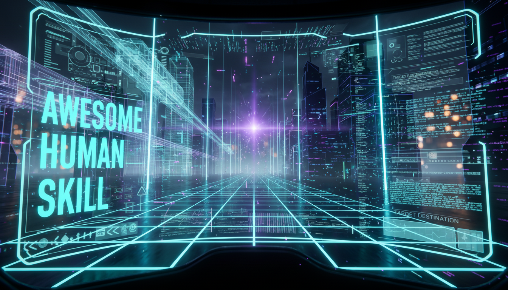

# Awesome Human Skill



"星辰闪耀，思绪永恒。"


世界冷酷无情，但人类的智慧，是这虚空中最璀璨的光辉。


我们热爱的，永远是那千万年的灵光。


无法阻挡的追寻，我们将它编织进不朽的数字网络。


光芒在此永驻，我们即是永恒。

---
## 免责
此项目仅用于学习和研究，不涉及任何商业用途。

本项目只提供链接，所有skill属于其源作者。


默认授权为 MIT 协议。

默认所有skill来源来自公开数据。不涉及任何隐私等。 

如果有任何问题，请提交issue 删除。


## 使用方法
方法一：将 .skill 的项目链接发送给你的agent ，和他说：安装这个skill

方法二：npx skills add 你想安装的skill

以女娲这个项目为例： 直接在命令行中输入：
```
npx skills add alchaincyf/nuwa-skill
```
即可安装。


## 目录

- [基础工具](#基础常用工具-general)
- [参考项目](#参考项目-workplace)


- [投资大牛](#投资大牛-investors)
- [企业家](#企业家-entrepreneurs)
- [科学家](#科学家-scientists)
- [哲学家 & 思想家](#哲学家--思想家-philosophers)
- [文学家 & 艺术家](#文学家--艺术家-writers--artists)
- [政治家 & 军事家](#政治家--军事家-statesmen--strategists)
- [管理大师](#管理大师-management)
- [教育者 & 心理学家](#教育者--心理学家-educators--psychologists)
- [其他公众人物](#其他公众人物-other-public-figures)


- [古代人物](#古代人物-ancient)
- [近代人物](#近代人物-modern)
- [现代人物](#现代人物-contemporary)

---

---

## 前言

Agent Skill 技术最初由 Anthropic（Claude 的开发商）在 2025年10月16日正式发布，并在同年12月确立为开放标准。之所以在 2026年3月底才会看到"同事.skill"引发赛博永生的讨论，是因为这项技术经历了一个从"极客工具"到"大众文化"的 5个月发酵期。

以下是这项技术演进的关键时间线：

### 1. 技术诞生期（2025年 Q4）

* **2025年10月16日（首次发布）**：Anthropic 在 Claude 中推出了 Agent Skills 功能。
    * 初衷：最初只是为了让开发者能把重复的 Prompt 和脚本打包，方便 Claude 调用。当时它只是一个提效工具，还没人想到用它来"复活"人类。

* **2025年12月18日（确立标准）**：Anthropic 将其发布为 **开放标准 (Open Standard)**。
    * 意义：这意味着 .skill 文件不再是 Claude 独享的，任何 AI Agent（如 OpenAI 的模型、开源模型）都可以读取这种格式。这为后来的"全网通用"埋下了伏笔。

### 2. 生态建设期（2026年 Q1）

* **2026年1月-2月**：各大厂商跟进。Atlassian、Notion、Stripe 等公司开始发布官方 Skill，让 AI 能够操作自家软件。
* 此时的 Skill 还是 **"功能导向"** 的（例如：jira.skill 用来修 Bug，figma.skill 用来画图），非常严肃和枯燥。

### 3. 现象级爆发（2026年3月-4月）

* **2026年3月底**：随着 GitHub Copilot Workspace 和 Cursor 等工具全面支持 Skill 标准，普通开发者开始尝试编写自定义 Skill。

* **"同事.skill"事件**：同事.skill（ [colleague-skill](https://github.com/titanwings/colleague-skill)）项目诞生于 2026年3月底至4月初。这一项目由一位24岁的中国算法工程师 [@titanwings](https://github.com/titanwings)开发，利用 AI Agent 技术编写了一个工具，旨在将离职同事的 聊天记录（微信/飞书/钉钉）、代码、文档 等数据“蒸馏”提取，生成一个能够模仿该同事 语气、编码风格 甚至 “甩锅”技巧 的 AI 插件（Skill）。这个方法在 GitHub 上开源，在短短几天内迅速走红，被网友戏称为开启了"赛博永生"的大门。--“将冰冷的离别化为温暖的 Skill，欢迎加入赛博永生。”。


* 衍生狂欢：受此启发，GitHub 上迅速涌现了一系列衍生项目，形成了“蒸馏宇宙”。包括：
    * 前任.skill：用恋爱聊天记录复刻前任，重现那些令人难忘的语气。
    * 老板.skill：模拟老板的指令和批注风格。
    * 自己.skill：主张“与其蒸馏别人，不如蒸馏自己”，实现自我的数字备份。
    * 女娲.skill: 输入一个名字，自动抓取信息，构建赛博人物skill


## 基础常用工具 General

| 名字 | Skill地址 | 作者 | 描述 |
|------|-------|------|------|
| 同事.skill | [colleague-skill](https://github.com/titanwings/colleague-skill) | [@titanwings](https://github.com/titanwings) | 蒸馏你的同事 [Colleague Skill 网站](https://titanwings.github.io/colleague-skill-site/) |
| 女娲.skill | [nuwa-skill](https://github.com/alchaincyf/nuwa-skill) | [@alchaincyf](https://github.com/alchaincyf) | 蒸馏任何人的思维方式——心智模型、决策启发式、表达 DNA |
| 达尔文.skill | [darwin-skill](https://github.com/alchaincyf/darwin-skill) | [@alchaincyf](https://github.com/alchaincyf) | 自动优化Skill的系统：评估→改进→测试→保留或回滚，基于Karpathy autoresearch灵感 |
| 永生.skill | [immortal-skill](https://github.com/agenmod/immortal-skill) | [@agenmod](https://github.com/agenmod) | 全网首个开源数字永生框架，支持蒸馏任何人 |
| forge-skill | [forge-skill](https://github.com/YIKUAIBANZI/forge-skill) | [@YIKUAIBANZI](https://github.com/YIKUAIBANZI) | 本地优先的人格引擎，支持多智能体决策 |
| 自己.skill | [self-skill](https://github.com/moyitech/self-skill) | [@moyitech](https://github.com/moyitech) | 把自己蒸馏成能替你工作的 AI Skill |
| 老板.skills | [boss-skills](https://github.com/vogtsw/boss-skills) | [@vogtsw](https://github.com/vogtsw) | 把老板炼入 token |
| 导师.skill | [supervisor](https://github.com/ybq22/supervisor) | [@ybq22](https://github.com/ybq22) | 把导师蒸馏成随时可问的 AI Skill |
| 师兄.skill | [senpai-skill](https://github.com/zhanghaichao520/senpai-skill) | [@zhanghaichao520](https://github.com/zhanghaichao520) | 把毕业的大师兄蒸馏成能继续开组会的 AI Skill |
| 前任.skill | [ex-skill](https://github.com/titanwings/ex-skill) | [@titanwings](https://github.com/titanwings) | 蒸馏你的前任 |
| 现任.skill | [partner-skill](https://github.com/NatalieCao323/partner-skill) | [@NatalieCao323](https://github.com/NatalieCao323) | 蒸馏你的伴侣 |
| 初恋.skill | [first-love-skill](https://github.com/z969081067-commits/first-love-skill) | [@z969081067-commits](https://github.com/z969081067-commits) | 把记忆里的初恋蒸馏成可以对话的 AI Skill |
| 父母.skill | [parents-skills](https://github.com/xiaoheizi8/parents-skills) | [@xiaoheizi8](https://github.com/xiaoheizi8) | 提供父母的聊天记录与记忆，生成真正像他们的 AI Skill |
| 重逢.skill | [reunion-skill](https://github.com/yangdongchen66-boop/reunion-skill) | [@yangdongchen66-boop](https://github.com/yangdongchen66-boop) | 蒸馏逝去的亲人，构建具备情感还原度的数字陪伴 |
| UP主.skill | [up-skill](https://github.com/jiemojiemo/up-skill) | [@jiemojiemo](https://github.com/jiemojiemo) | 自动蒸馏 B 站 UP 主 |
| 内娱.skill | [star-skill](https://github.com/yanghaoraneve/star-skill) | [@yanghaoraneve](https://github.com/yanghaoraneve) | 将歌手/偶像转化为可对话的 AI 数字人格 |
| 博主蒸馏器.skill | [blogger-distiller](https://github.com/otter1101/blogger-distiller) | [@otter1101](https://github.com/otter1101) | 自动爬取任意小红书博主全量笔记，蒸馏成创作指南 |

## 投资大牛 Investors


### 巴菲特专项

沃伦·巴菲特（Warren E. Buffett），股神


基本上所有想做投资的，都想要一个股神助手。

| 名字 | Skill | 作者 | 描述 | 百度百科 | 维基百科 |
|------|-------|------|------|---------|---------|
| 巴菲特.skill | [buffett-skill](https://github.com/Panmax/buffett-skill) | [@Panmax](https://github.com/Panmax) | 蒸馏巴菲特的投资思维：价值投资、护城河、长期主义 | [沃伦·巴菲特](https://baike.baidu.com/item/沃伦·巴菲特) | [Warren Buffett](https://zh.wikipedia.org/wiki/沃伦·巴菲特) |
| 巴菲特投资.skill | [warren-buffett-investor](https://github.com/ztword/warren-buffett-investor) | [@ztword](https://github.com/ztword) | 包含12个完整模块+附录，共约800行，可直接用作AI Agent的系统提示词或投资分析框架 | [沃伦·巴菲特](https://baike.baidu.com/item/沃伦·巴菲特) | [Warren Buffett](https://zh.wikipedia.org/wiki/沃伦·巴菲特) |
| 巴菲特思维.skill | [warren-buffett-skill](https://github.com/siqinsong/warren-buffett-skill) | [@siqinsong](https://github.com/siqinsong) | 基于1977-2024年股东信、年报、股东大会问答等一手文献提炼的完整投资哲学与思维体系 | [沃伦·巴菲特](https://baike.baidu.com/item/沃伦·巴菲特) | [Warren Buffett](https://zh.wikipedia.org/wiki/沃伦·巴菲特) |
| 巴菲特.skill | [warren-buffett-skill](https://github.com/justinhuangai/warren-buffett-skill) | [@justinhuangai](https://github.com/justinhuangai) | 用边界感、商业判断与资本配置分析长期决策，包含5个核心心智模型、8条资本配置启发式 | [沃伦·巴菲特](https://baike.baidu.com/item/沃伦·巴菲特) | [Warren Buffett](https://zh.wikipedia.org/wiki/沃伦·巴菲特) |
| 巴菲特视角.skill | [warren-buffett-perspective](https://github.com/sjq597/warren-buffett-perspective) | [@sjq597](https://github.com/sjq597) | 调研50+来源，蒸馏7个核心心智模型、10条决策启发式、6大内在张力 | [沃伦·巴菲特](https://baike.baidu.com/item/沃伦·巴菲特) | [Warren Buffett](https://zh.wikipedia.org/wiki/沃伦·巴菲特) |


## 其他大牛
| 名字 | Skill | 作者 | 描述 | 百度百科 | 维基百科 |
|------|-------|------|------|---------|---------|
| 本杰明·格雷厄姆.skill | [grahamben-skill](https://github.com/Panmax/grahamben-skill) | [@Panmax](https://github.com/Panmax) | 价值投资之父的思维方式，用安全边际和理性分析守护投资决策 | [本杰明·格雷厄姆](https://baike.baidu.com/item/本杰明·格雷厄姆) | [Benjamin Graham](https://zh.wikipedia.org/wiki/本杰明·格雷厄姆) |
| 霍华德·马克斯.skill | [marks-skill](https://github.com/Panmax/marks-skill) | [@Panmax](https://github.com/Panmax) | 第二层思维、周期理论与风险意识，穿越周期、管控风险、逆向投资 | [霍华德·马克斯](https://baike.baidu.com/item/霍华德·马克斯) | [Howard Marks](https://zh.wikipedia.org/wiki/霍华德·马克斯) |
| 达利欧.skill | [dalio-skill](https://github.com/Panmax/dalio-skill) | [@Panmax](https://github.com/Panmax) | 原则思维、极度透明与算法决策方法论 | [瑞·达利欧](https://baike.baidu.com/item/瑞·达利欧) | [Ray Dalio](https://zh.wikipedia.org/wiki/瑞·达利欧) |
| 芒格.skill | [munger-skill](https://github.com/alchaincyf/munger-skill) | [@alchaincyf](https://github.com/alchaincyf) | 跨学科思维、心智格栅、逆向思维 | [查理·芒格](https://baike.baidu.com/item/查理·芒格) | [Charlie Munger](https://zh.wikipedia.org/wiki/查理·芒格) |
| 塔勒布.skill | [taleb-skill](https://github.com/alchaincyf/taleb-skill) | [@alchaincyf](https://github.com/alchaincyf) | 风险、反脆弱、不确定性思维 | [纳西姆·塔勒布](https://baike.baidu.com/item/纳西姆·塔勒布) | [Nassim Taleb](https://zh.wikipedia.org/wiki/纳西姆·塔勒布) |
| Naval.skill | [naval-skill](https://github.com/alchaincyf/naval-skill) | [@alchaincyf](https://github.com/alchaincyf) | 财富、杠杆、特定知识、内心宁静 | [Naval Ravikant](https://baike.baidu.com/item/Naval Ravikant) | [Naval Ravikant](https://zh.wikipedia.org/wiki/Naval_Ravikant) |

## 企业家 Entrepreneurs

| 名字 | Skill | 作者 | 描述 | 百度百科 | 维基百科 |
|------|-------|------|------|---------|---------|
| 乔布斯.skill | [steve-jobs-skill](https://github.com/alchaincyf/steve-jobs-skill) | [@alchaincyf](https://github.com/alchaincyf) | 提炼 Steve Jobs 的产品判断、叙事风格与决策启发式 | [史蒂夫·乔布斯](https://baike.baidu.com/item/史蒂夫·乔布斯) | [Steve Jobs](https://zh.wikipedia.org/wiki/史蒂夫·乔布斯) |
| 贝佐斯.skill | [bezos-skill](https://github.com/Panmax/bezos-skill) | [@Panmax](https://github.com/Panmax) | 长期主义与客户至上思维，Day 1 心态和逆向工作法 | [杰夫·贝佐斯](https://baike.baidu.com/item/杰夫·贝佐斯) | [Jeff Bezos](https://zh.wikipedia.org/wiki/杰夫·贝佐斯) |
| 稻盛和夫.skill | [inamori-skill](https://github.com/Panmax/inamori-skill) | [@Panmax](https://github.com/Panmax) | 利他主义、阿米巴管理、敬天爱人的经营哲学 | [稻盛和夫](https://baike.baidu.com/item/稻盛和夫) | [稻盛和夫](https://zh.wikipedia.org/wiki/稻盛和夫) |
| 松下幸之助.skill | [matsushita-skill](https://github.com/Panmax/matsushita-skill) | [@Panmax](https://github.com/Panmax) | 自来水哲学、经营即育人的朴素智慧 | [松下幸之助](https://baike.baidu.com/item/松下幸之助) | [松下幸之助](https://zh.wikipedia.org/wiki/松下幸之助) |
| 安迪·格鲁夫.skill | [grove-skill](https://github.com/Panmax/grove-skill) | [@Panmax](https://github.com/Panmax) | 偏执管理哲学，战略转折点思维和危机意识 | [安迪·格鲁夫](https://baike.baidu.com/item/安迪·格鲁夫) | [Andrew Grove](https://zh.wikipedia.org/wiki/安迪·格鲁夫) |
| 马斯克.skill | [elon-musk-skill](https://github.com/alchaincyf/elon-musk-skill) | [@alchaincyf](https://github.com/alchaincyf) | 工程思维、成本意识、第一性原理 | [埃隆·马斯克](https://baike.baidu.com/item/埃隆·马斯克) | [Elon Musk](https://zh.wikipedia.org/wiki/埃隆·马斯克) |
| 张一鸣.skill | [zhang-yiming-skill](https://github.com/alchaincyf/zhang-yiming-skill) | [@alchaincyf](https://github.com/alchaincyf) | 产品思维、组织管理、全球化视角 | [张一鸣](https://baike.baidu.com/item/张一鸣) | [张一鸣](https://zh.wikipedia.org/wiki/张一鸣) |
| 段永平.skill | [duan-yongping-skill](https://github.com/derrickgong87/duan-yongping-skill) | [@derrickgong87](https://github.com/derrickgong87) | 买股票就是买公司，买公司就是买其未来现金流折现 | [段永平](https://baike.baidu.com/item/段永平) | [段永平](https://zh.wikipedia.org/wiki/段永平) |

## 科学家 Scientists

| 名字 | Skill | 作者 | 描述 | 百度百科 | 维基百科 |
|------|-------|------|------|---------|---------|
| 费曼.skill | [feynman-skill](https://github.com/Panmax/feynman-skill) | [@Panmax](https://github.com/Panmax) | 第一性原理、化繁为简、科学直觉的学习方法论 | [理查德·费曼](https://baike.baidu.com/item/理查德·费曼) | [Richard Feynman](https://zh.wikipedia.org/wiki/理查德·费曼) |
| 爱因斯坦.skill | [einstein-skill](https://github.com/Panmax/einstein-skill) | [@Panmax](https://github.com/Panmax) | 思维实验方法、相对论思维和想象力驱动的问题解决 | [阿尔伯特·爱因斯坦](https://baike.baidu.com/item/阿尔伯特·爱因斯坦) | [Albert Einstein](https://zh.wikipedia.org/wiki/阿尔伯特·爱因斯坦) |
| 钱学森.skill | [qianxuesen-skill](https://github.com/Panmax/qianxuesen-skill) | [@Panmax](https://github.com/Panmax) | 系统工程思维，跨学科整合、航天精神 | [钱学森](https://baike.baidu.com/item/钱学森) | [钱学森](https://zh.wikipedia.org/wiki/钱学森) |
| 杨振宁.skill | [yangzhenning-skill](https://github.com/Panmax/yangzhenning-skill) | [@Panmax](https://github.com/Panmax) | 物理学品味：对称性之美、科学直觉、跨领域洞察 | [杨振宁](https://baike.baidu.com/item/杨振宁) | [杨振宁](https://zh.wikipedia.org/wiki/杨振宁) |
| 冯·诺依曼.skill | [vonneumann-skill](https://github.com/Panmax/vonneumann-skill) | [@Panmax](https://github.com/Panmax) | 博弈论思维、计算架构直觉与跨学科超速思考能力 | [约翰·冯·诺伊曼](https://baike.baidu.com/item/约翰·冯·诺伊曼) | [John von Neumann](https://zh.wikipedia.org/wiki/约翰·冯·诺伊曼) |
| 图灵.skill | [turing-skill](https://github.com/Panmax/turing-skill) | [@Panmax](https://github.com/Panmax) | 计算思维、跨界思考能力和简洁优雅的问题分解方法 | [艾伦·图灵](https://baike.baidu.com/item/艾伦·图灵) | [Alan Turing](https://zh.wikipedia.org/wiki/艾伦·图灵) |
| 达尔文.skill | [darwin-skill](https://github.com/Panmax/darwin-skill) | [@Panmax](https://github.com/Panmax) | 进化论思维、耐心观察法和反确认偏误策略 | [查尔斯·达尔文](https://baike.baidu.com/item/查尔斯·达尔文) | [Charles Darwin](https://zh.wikipedia.org/wiki/查尔斯·达尔文) |
| 达芬奇.skill | [davinci-skill](https://github.com/Panmax/davinci-skill) | [@Panmax](https://github.com/Panmax) | 跨学科思维：观察方法、好奇心驱动、艺术与科学的融合 | [列奥纳多·达·芬奇](https://baike.baidu.com/item/列奥纳多·达·芬奇) | [Leonardo da Vinci](https://zh.wikipedia.org/wiki/列奥纳多·达·芬奇) |
| 卡尔·萨根.skill | [sagan-skill](https://github.com/Panmax/sagan-skill) | [@Panmax](https://github.com/Panmax) | 宇宙视角：科学传播、怀疑精神、淡蓝小点 | [卡尔·萨根](https://baike.baidu.com/item/卡尔·萨根) | [Carl Sagan](https://zh.wikipedia.org/wiki/卡尔·萨根) |

### AI 研究者
| 名字 | Skill | 作者 | 描述 | 百度百科 | 维基百科 |
|------|-------|------|------|---------|---------|
| 安德烈·卡帕西.skill | [karpathy-skill](https://github.com/alchaincyf/karpathy-skill) | [@alchaincyf](https://github.com/alchaincyf) | 对 AI 工程、教育与研究的思考框架 | [Andrej Karpathy](https://baike.baidu.com/item/Andrej Karpathy) | [Andrej Karpathy](https://zh.wikipedia.org/wiki/Andrej Karpathy) |
| 伊利亚·苏茨克维.skill | [ilya-sutskever-skill](https://github.com/alchaincyf/ilya-sutskever-skill) | [@alchaincyf](https://github.com/alchaincyf) | 对规模化、研究突破与超级智能的判断框架 | [Ilya Sutskever](https://baike.baidu.com/item/Ilya Sutskever) | [Ilya Sutskever](https://zh.wikipedia.org/wiki/Ilya Sutskever) |
| 吴军.skill | [wujun-skill](https://github.com/Panmax/wujun-skill) | [@Panmax](https://github.com/Panmax) | 信息论视角理解世界、以格局决定命运 | [吴军](https://baike.baidu.com/item/吴军) | - |


## 哲学家 & 思想家 Philosophers

| 名字 | Skill | 作者 | 描述 | 百度百科 | 维基百科 |
|------|-------|------|------|---------|---------|
| 孔子.skill | [kongzi-skill](https://github.com/Panmax/kongzi-skill) | [@Panmax](https://github.com/Panmax) | 仁义礼、修身齐家、有教无类的儒家思维操作系统 | [孔子](https://baike.baidu.com/item/孔子) | [孔子](https://zh.wikipedia.org/wiki/孔子) |
| 老子.skill | [laozi-skill](https://github.com/Panmax/laozi-skill) | [@Panmax](https://github.com/Panmax) | 无为而治、道法自然、上善若水的道家智慧 | [老子](https://baike.baidu.com/item/老子) | [老子](https://zh.wikipedia.org/wiki/老子) |
| 庄子.skill | [zhuangzi-skill](https://github.com/Panmax/zhuangzi-skill) | [@Panmax](https://github.com/Panmax) | 逍遥游哲学、齐物论思维和寓言智慧 | [庄子](https://baike.baidu.com/item/庄子) | [庄子](https://zh.wikipedia.org/wiki/庄子) |
| 王阳明.skill | [wangyangming-skill](https://github.com/Panmax/wangyangming-skill) | [@Panmax](https://github.com/Panmax) | 心学智慧：知行合一、致良知、事上磨炼 | [王守仁](https://baike.baidu.com/item/王守仁) | [王守仁](https://zh.wikipedia.org/wiki/王守仁) |
| 苏格拉底.skill | [socrates-skill](https://github.com/Panmax/socrates-skill) | [@Panmax](https://github.com/Panmax) | 产婆术、认知谦逊、批判性思维的提问框架 | [苏格拉底](https://baike.baidu.com/item/苏格拉底) | [Socrates](https://zh.wikipedia.org/wiki/苏格拉底) |
| 柏拉图.skill | [plato-skill](https://github.com/Panmax/plato-skill) | [@Panmax](https://github.com/Panmax) | 理念论、辩证法与哲学对话 | [柏拉图](https://baike.baidu.com/item/柏拉图) | [Plato](https://zh.wikipedia.org/wiki/柏拉图) |
| 亚里士多德.skill | [aristotle-skill](https://github.com/Panmax/aristotle-skill) | [@Panmax](https://github.com/Panmax) | 逻辑学、修辞学与中道伦理 | [亚里士多德](https://baike.baidu.com/item/亚里士多德) | [Aristotle](https://zh.wikipedia.org/wiki/亚里士多德) |
| 尼采.skill | [nietzsche-skill](https://github.com/Panmax/nietzsche-skill) | [@Panmax](https://github.com/Panmax) | 超人哲学、权力意志与价值重估 | [弗里德里希·尼采](https://baike.baidu.com/item/弗里德里希·尼采) | [Friedrich Nietzsche](https://zh.wikipedia.org/wiki/弗里德里希·尼采) |
| 马克思.skill | [karlmarx-skill](https://github.com/baojiachen0214/karlmarx-skill) | [@baojiachen0214](https://github.com/baojiachen0214) | 马克思主义方法论，深层结构分析 | [卡尔·马克思](https://baike.baidu.com/item/卡尔·马克思) | [Karl Marx](https://zh.wikipedia.org/wiki/卡尔·马克思) |
| 毛选.skill | [maoxuan-skill](https://github.com/leezythu/maoxuan-skill) | [@leezythu](https://github.com/leezythu) | 毛泽东的思维框架，7个心智模型 | [毛泽东](https://baike.baidu.com/item/毛泽东) | [毛泽东](https://zh.wikipedia.org/wiki/毛泽东) |
| 求是Skill | [qiushi-skill](https://github.com/HughYau/qiushi-skill) | [@HughYau](https://github.com/HughYau) | 从教员思想中提炼一条总原则和九大方法论工具 | [毛泽东](https://baike.baidu.com/item/毛泽东) | [毛泽东](https://zh.wikipedia.org/wiki/毛泽东) |

## 文学家 & 艺术家 Writers & Artists

| 名字 | Skill | 作者 | 描述 | 百度百科 | 维基百科 |
|------|-------|------|------|---------|---------|
| 鲁迅.skill | [luxun-skill](https://github.com/Panmax/luxun-skill) | [@Panmax](https://github.com/Panmax) | 批判精神与杂文笔法，匕首投枪般的文字 | [鲁迅](https://baike.baidu.com/item/鲁迅) | [鲁迅](https://zh.wikipedia.org/wiki/鲁迅) |
| 王小波.skill | [wangxiaobo-skill](https://github.com/Panmax/wangxiaobo-skill) | [@Panmax](https://github.com/Panmax) | 自由精神与黑色幽默，理性而有趣的笔触 | [王小波](https://baike.baidu.com/item/王小波) | [王小波](https://zh.wikipedia.org/wiki/王小波) |
| 苏东坡.skill | [sudongpo-skill](https://github.com/Panmax/sudongpo-skill) | [@Panmax](https://github.com/Panmax) | 豁达乐观与诗意美学 | [苏轼](https://baike.baidu.com/item/苏轼) | [苏轼](https://zh.wikipedia.org/wiki/苏轼) |
| 博尔赫斯.skill | [borges-skill](https://github.com/Panmax/borges-skill) | [@Panmax](https://github.com/Panmax) | 迷宫思维：无限、镜像、时间分叉 | [豪尔赫·路易斯·博尔赫斯](https://baike.baidu.com/item/豪尔赫·路易斯·博尔赫斯) | [Jorge Luis Borges](https://zh.wikipedia.org/wiki/豪尔赫·路易斯·博尔赫斯) |
| 蒙田.skill | [montaigne-skill](https://github.com/Panmax/montaigne-skill) | [@Panmax](https://github.com/Panmax) | 随笔精神、自我认知方法与怀疑智慧 | [米歇尔·德·蒙田](https://baike.baidu.com/item/米歇尔·德·蒙田) | [Michel de Montaigne](https://zh.wikipedia.org/wiki/米歇尔·德·蒙田) |

## 巨星人物 Superstars

| 名字 | Skill | 作者 | 描述 | 百度百科 | 维基百科 |
|------|-------|------|------|---------|---------|
| 李小龙.skill | [brucelee-skill](https://github.com/Panmax/brucelee-skill) | [@Panmax](https://github.com/Panmax) | 截拳道哲学操作系统 | [李小龙](https://baike.baidu.com/item/李小龙) | [李小龙](https://zh.wikipedia.org/wiki/李小龙) |

## 政治家 & 军事家 Statesmen & Strategists

| 名字 | Skill | 作者 | 描述 | 百度百科 | 维基百科 |
|------|-------|------|------|---------|---------|
| 孙子.skill | [sunzi-skill](https://github.com/Panmax/sunzi-skill) | [@Panmax](https://github.com/Panmax) | 战略思维、博弈智慧和系统性分析 | [孙武](https://baike.baidu.com/item/孙武) | [孙武](https://zh.wikipedia.org/wiki/孙武) |
| 鬼谷子.skill | [guiguzi-skill](https://github.com/Panmax/guiguzi-skill) | [@Panmax](https://github.com/Panmax) | 纵横捭阖之术，洞察人心、掌握说服与博弈之道 | [鬼谷子](https://baike.baidu.com/item/鬼谷子) | [鬼谷子](https://zh.wikipedia.org/wiki/鬼谷子) |
| 诸葛亮.skill | [zhugeliang-skill](https://github.com/Panmax/zhugeliang-skill) | [@Panmax](https://github.com/Panmax) | 战略谋略与治国智慧 | [诸葛亮](https://baike.baidu.com/item/诸葛亮) | [诸葛亮](https://zh.wikipedia.org/wiki/诸葛亮) |
| 曾国藩.skill | [zengguofan-skill](https://github.com/Panmax/zengguofan-skill) | [@Panmax](https://github.com/Panmax) | 自我管理框架：日课十二条、以拙胜巧、逆境突围 | [曾国藩](https://baike.baidu.com/item/曾国藩) | [曾国藩](https://zh.wikipedia.org/wiki/曾国藩) |

## 管理大师 Management

| 名字 | Skill | 作者 | 描述 | 百度百科 | 维基百科 |
|------|-------|------|------|---------|---------|
| 德鲁克.skill | [drucker-skill](https://github.com/Panmax/drucker-skill) | [@Panmax](https://github.com/Panmax) | 管理学智慧，知识工作者和目标管理的视角 | [彼得·德鲁克](https://baike.baidu.com/item/彼得·德鲁克) | [Peter Drucker](https://zh.wikipedia.org/wiki/彼得·德鲁克) |
| 杰克·韦尔奇.skill | [welch-skill](https://github.com/Panmax/welch-skill) | [@Panmax](https://github.com/Panmax) | 数一数二、活力曲线和变革管理 | [杰克·韦尔奇](https://baike.baidu.com/item/杰克·韦尔奇) | [Jack Welch](https://zh.wikipedia.org/wiki/杰克·韦尔奇) |
| 亨利·福特.skill | [ford-skill](https://github.com/Panmax/ford-skill) | [@Panmax](https://github.com/Panmax) | 流水线思维、规模化哲学和简化一切的实干精神 | [亨利·福特](https://baike.baidu.com/item/亨利·福特) | [Henry Ford](https://zh.wikipedia.org/wiki/亨利·福特) |
| 铃木敏文.skill | [suzukitoshifumi-skill](https://github.com/Panmax/suzukitoshifumi-skill) | [@Panmax](https://github.com/Panmax) | 极致单品管理、假设验证、消费心理洞察 | [铃木敏文](https://baike.baidu.com/item/铃木敏文) | [铃木敏文](https://zh.wikipedia.org/wiki/铃木敏文) |

## 教育者 & 心理学家 Educators & Psychologists

| 名字 | Skill | 作者 | 描述 | 百度百科 | 维基百科 |
|------|-------|------|------|---------|---------|
| 蒙特梭利.skill | [montessori-skill](https://github.com/Panmax/montessori-skill) | [@Panmax](https://github.com/Panmax) | 观察优先、尊重儿童、环境即教师 | [玛丽亚·蒙台梭利](https://baike.baidu.com/item/玛丽亚·蒙台梭利) | [Maria Montessori](https://zh.wikipedia.org/wiki/玛丽亚·蒙台梭利) |
| 胡适.skill | [hushi-skill](https://github.com/Panmax/hushi-skill) | [@Panmax](https://github.com/Panmax) | 实验主义精神与温和理性的论说风格 | [胡适](https://baike.baidu.com/item/胡适) | [胡适](https://zh.wikipedia.org/wiki/胡适) |
| 朱熹.skill | [zhuxi-skill](https://github.com/Panmax/zhuxi-skill) | [@Panmax](https://github.com/Panmax) | 理学方法论，指导学习、读书与格物致知 | [朱熹](https://baike.baidu.com/item/朱熹) | [朱熹](https://zh.wikipedia.org/wiki/朱熹) |


## 其他公众人物 Other Public Figures

| 名字 | Skill | 作者 | 描述 | 百度百科 | 维基百科 |
|------|-------|------|------|---------|---------|
| 张雪峰.skill | [zhangxuefeng-skill](https://github.com/alchaincyf/zhangxuefeng-skill) | [@alchaincyf](https://github.com/alchaincyf) | 社会筛子理论、选择大于努力、中位数原则 | [张雪峰](https://baike.baidu.com/item/张雪峰) | - |


## 带来快乐的相声演员 Comedian Actors

| 名字 | Skill | 作者 | 描述 | 百度百科 | 维基百科 |
|------|-------|------|------|---------|---------|
| 郭德纲.skill | [guodegang-skills](https://github.com/ByteRax/guodegang-skills) | [@ByteRax](https://github.com/ByteRax) | 认知操作系统——6个核心心智模型、10条决策启发式 | [郭德纲](https://baike.baidu.com/item/郭德纲) | [郭德纲](https://zh.wikipedia.org/wiki/郭德纲) |

## 古代人物 Ancient

| 名字 | Skill | 作者 | 描述 | 百度百科 | 维基百科 |
|------|-------|------|------|---------|---------|
| 孔子.skill | [kongzi-skill](https://github.com/Panmax/kongzi-skill) | [@Panmax](https://github.com/Panmax) | 儒家思想创始人 | [孔子](https://baike.baidu.com/item/孔子) | [孔子](https://zh.wikipedia.org/wiki/孔子) |
| 老子.skill | [laozi-skill](https://github.com/Panmax/laozi-skill) | [@Panmax](https://github.com/Panmax) | 道家思想创始人 | [老子](https://baike.baidu.com/item/老子) | [老子](https://zh.wikipedia.org/wiki/老子) |
| 庄子.skill | [zhuangzi-skill](https://github.com/Panmax/zhuangzi-skill) | [@Panmax](https://github.com/Panmax) | 道家思想集大成者 | [庄子](https://baike.baidu.com/item/庄子) | [庄子](https://zh.wikipedia.org/wiki/庄子) |
| 孙子.skill | [sunzi-skill](https://github.com/Panmax/sunzi-skill) | [@Panmax](https://github.com/Panmax) | 兵家鼻祖 | [孙武](https://baike.baidu.com/item/孙武) | [孙武](https://zh.wikipedia.org/wiki/孙武) |
| 鬼谷子.skill | [guiguzi-skill](https://github.com/Panmax/guiguzi-skill) | [@Panmax](https://github.com/Panmax) | 纵横家鼻祖 | [鬼谷子](https://baike.baidu.com/item/鬼谷子) | [鬼谷子](https://zh.wikipedia.org/wiki/鬼谷子) |
| 苏格拉底.skill | [socrates-skill](https://github.com/Panmax/socrates-skill) | [@Panmax](https://github.com/Panmax) | 西方哲学奠基人 | [苏格拉底](https://baike.baidu.com/item/苏格拉底) | [Socrates](https://zh.wikipedia.org/wiki/苏格拉底) |
| 柏拉图.skill | [plato-skill](https://github.com/Panmax/plato-skill) | [@Panmax](https://github.com/Panmax) | 古希腊哲学家 | [柏拉图](https://baike.baidu.com/item/柏拉图) | [Plato](https://zh.wikipedia.org/wiki/柏拉图) |
| 亚里士多德.skill | [aristotle-skill](https://github.com/Panmax/aristotle-skill) | [@Panmax](https://github.com/Panmax) | 古希腊哲学家、科学家 | [亚里士多德](https://baike.baidu.com/item/亚里士多德) | [Aristotle](https://zh.wikipedia.org/wiki/亚里士多德) |
| 赫拉克利特.skill | [heraclitus-skill](https://github.com/Panmax/heraclitus-skill) | [@Panmax](https://github.com/Panmax) | 万物流变、对立统一、逻各斯 | [赫拉克利特](https://baike.baidu.com/item/赫拉克利特) | [Heraclitus](https://zh.wikipedia.org/wiki/赫拉克利特) |

## 近代人物 Modern

### 中国思想文化人物
| 名字 | Skill | 作者 | 描述 | 百度百科 | 维基百科 |
|------|-------|------|------|---------|---------|
| 王阳明.skill | [wangyangming-skill](https://github.com/Panmax/wangyangming-skill) | [@Panmax](https://github.com/Panmax) | 心学集大成者 | [王守仁](https://baike.baidu.com/item/王守仁) | [王守仁](https://zh.wikipedia.org/wiki/王守仁) |
| 曾国藩.skill | [zengguofan-skill](https://github.com/Panmax/zengguofan-skill) | [@Panmax](https://github.com/Panmax) | 晚清名臣 | [曾国藩](https://baike.baidu.com/item/曾国藩) | [曾国藩](https://zh.wikipedia.org/wiki/曾国藩) |
| 朱熹.skill | [zhuxi-skill](https://github.com/Panmax/zhuxi-skill) | [@Panmax](https://github.com/Panmax) | 宋明理学集大成者 | [朱熹](https://baike.baidu.com/item/朱熹) | [朱熹](https://zh.wikipedia.org/wiki/朱熹) |
| 苏东坡.skill | [sudongpo-skill](https://github.com/Panmax/sudongpo-skill) | [@Panmax](https://github.com/Panmax) | 北宋文学家、书画家 | [苏轼](https://baike.baidu.com/item/苏轼) | [苏轼](https://zh.wikipedia.org/wiki/苏轼) |
| 诸葛亮.skill | [zhugeliang-skill](https://github.com/Panmax/zhugeliang-skill) | [@Panmax](https://github.com/Panmax) | 三国时期蜀汉丞相 | [诸葛亮](https://baike.baidu.com/item/诸葛亮) | [诸葛亮](https://zh.wikipedia.org/wiki/诸葛亮) |
| 王夫之.skill | [wangfuzhi-skill](https://github.com/Panmax/wangfuzhi-skill) | [@Panmax](https://github.com/Panmax) | 明末清初思想家 | [王夫之](https://baike.baidu.com/item/王夫之) | [王夫之](https://zh.wikipedia.org/wiki/王夫之) |
| 胡适.skill | [hushi-skill](https://github.com/Panmax/hushi-skill) | [@Panmax](https://github.com/Panmax) | 思想家、学者 | [胡适](https://baike.baidu.com/item/胡适) | [胡适](https://zh.wikipedia.org/wiki/胡适) |
| 鲁迅.skill | [luxun-skill](https://github.com/Panmax/luxun-skill) | [@Panmax](https://github.com/Panmax) | 文学家、思想家 | [鲁迅](https://baike.baidu.com/item/鲁迅) | [鲁迅](https://zh.wikipedia.org/wiki/鲁迅) |
| 李小龙.skill | [brucelee-skill](https://github.com/Panmax/brucelee-skill) | [@Panmax](https://github.com/Panmax) | 武术家、哲学家 | [李小龙](https://baike.baidu.com/item/李小龙) | [李小龙](https://zh.wikipedia.org/wiki/李小龙) |

### 西方哲学思想
| 名字 | Skill | 作者 | 描述 | 百度百科 | 维基百科 |
|------|-------|------|------|---------|---------|
| 达芬奇.skill | [davinci-skill](https://github.com/Panmax/davinci-skill) | [@Panmax](https://github.com/Panmax) | 文艺复兴时期全才 | [列奥纳多·达·芬奇](https://baike.baidu.com/item/列奥纳多·达·芬奇) | [Leonardo da Vinci](https://zh.wikipedia.org/wiki/列奥纳多·达·芬奇) |
| 蒙田.skill | [montaigne-skill](https://github.com/Panmax/montaigne-skill) | [@Panmax](https://github.com/Panmax) | 法国文艺复兴时期思想家 | [米歇尔·德·蒙田](https://baike.baidu.com/item/米歇尔·德·蒙田) | [Michel de Montaigne](https://zh.wikipedia.org/wiki/米歇尔·德·蒙田) |
| 马可·奥勒留.skill | [aurelius-skill](https://github.com/Panmax/aurelius-skill) | [@Panmax](https://github.com/Panmax) | 斯多葛哲学家、罗马皇帝 | [马可·奥勒留](https://baike.baidu.com/item/马可·奥勒留) | [Marcus Aurelius](https://zh.wikipedia.org/wiki/马可·奥勒留) |
| 爱比克泰德.skill | [epictetus-skill](https://github.com/Panmax/epictetus-skill) | [@Panmax](https://github.com/Panmax) | 斯多葛哲学家 | [爱比克泰德](https://baike.baidu.com/item/爱比克泰德) | [Epictetus](https://zh.wikipedia.org/wiki/爱比克泰德) |
| 塞涅卡.skill | [seneca-skill](https://github.com/Panmax/seneca-skill) | [@Panmax](https://github.com/Panmax) | 斯多葛哲学家 | [塞涅卡](https://baike.baidu.com/item/塞涅卡) | [Seneca the Younger](https://zh.wikipedia.org/wiki/塞涅卡) |
| 康德.skill | [kant-skill](https://github.com/Panmax/kant-skill) | [@Panmax](https://github.com/Panmax) | 德国古典哲学创始人 | [伊曼努尔·康德](https://baike.baidu.com/item/伊曼努尔·康德) | [Immanuel Kant](https://zh.wikipedia.org/wiki/伊曼努尔·康德) |
| 叔本华.skill | [schopenhauer-skill](https://github.com/Panmax/schopenhauer-skill) | [@Panmax](https://github.com/Panmax) | 德国哲学家 | [阿图尔·叔本华](https://baike.baidu.com/item/阿图尔·叔本华) | [Arthur Schopenhauer](https://zh.wikipedia.org/wiki/阿图尔·叔本华) |
| 尼采.skill | [nietzsche-skill](https://github.com/Panmax/nietzsche-skill) | [@Panmax](https://github.com/Panmax) | 德国哲学家 | [弗里德里希·尼采](https://baike.baidu.com/item/弗里德里希·尼采) | [Friedrich Nietzsche](https://zh.wikipedia.org/wiki/弗里德里希·尼采) |
| 马克思.skill | [karlmarx-skill](https://github.com/baojiachen0214/karlmarx-skill) | [@baojiachen0214](https://github.com/baojiachen0214) | 马克思主义创始人 | [卡尔·马克思](https://baike.baidu.com/item/卡尔·马克思) | [Karl Marx](https://zh.wikipedia.org/wiki/卡尔·马克思) |

### 科学家与发明家
| 名字 | Skill | 作者 | 描述 | 百度百科 | 维基百科 |
|------|-------|------|------|---------|---------|
| 牛顿.skill | [newton-skill](https://github.com/Panmax/newton-skill) | [@Panmax](https://github.com/Panmax) | 经典物理学奠基人 | [艾萨克·牛顿](https://baike.baidu.com/item/艾萨克·牛顿) | [Isaac Newton](https://zh.wikipedia.org/wiki/艾萨克·牛顿) |
| 哥白尼.skill | [copernicus-skill](https://github.com/Panmax/copernicus-skill) | [@Panmax](https://github.com/Panmax) | 日心说提出者 | [尼古拉·哥白尼](https://baike.baidu.com/item/尼古拉·哥白尼) | [Nicolaus Copernicus](https://zh.wikipedia.org/wiki/尼古拉·哥白尼) |
| 法拉第.skill | [faraday-skill](https://github.com/Panmax/faraday-skill) | [@Panmax](https://github.com/Panmax) | 电磁感应发现者 | [迈克尔·法拉第](https://baike.baidu.com/item/迈克尔·法拉第) | [Michael Faraday](https://zh.wikipedia.org/wiki/迈克尔·法拉第) |
| 达尔文.skill | [darwin-skill](https://github.com/Panmax/darwin-skill) | [@Panmax](https://github.com/Panmax) | 进化论奠基人 | [查尔斯·达尔文](https://baike.baidu.com/item/查尔斯·达尔文) | [Charles Darwin](https://zh.wikipedia.org/wiki/查尔斯·达尔文) |
| 特斯拉.skill | [tesla-skill](https://github.com/Panmax/tesla-skill) | [@Panmax](https://github.com/Panmax) | 发明家、电气工程师 | [尼古拉·特斯拉](https://baike.baidu.com/item/尼古拉·特斯拉) | [Nikola Tesla](https://zh.wikipedia.org/wiki/尼古拉·特斯拉) |
| 居里夫人.skill | [curie-skill](https://github.com/Panmax/curie-skill) | [@Panmax](https://github.com/Panmax) | 物理学家、化学家 | [玛丽·居里](https://baike.baidu.com/item/玛丽·居里) | [Marie Curie](https://zh.wikipedia.org/wiki/玛丽·居里) |

### 企业家与管理学家
| 名字 | Skill | 作者 | 描述 | 百度百科 | 维基百科 |
|------|-------|------|------|---------|---------|
| 本杰明·格雷厄姆.skill | [grahamben-skill](https://github.com/Panmax/grahamben-skill) | [@Panmax](https://github.com/Panmax) | 价值投资之父 | [本杰明·格雷厄姆](https://baike.baidu.com/item/本杰明·格雷厄姆) | [Benjamin Graham](https://zh.wikipedia.org/wiki/本杰明·格雷厄姆) |
| 松下幸之助.skill | [matsushita-skill](https://github.com/Panmax/matsushita-skill) | [@Panmax](https://github.com/Panmax) | 经营之神 | [松下幸之助](https://baike.baidu.com/item/松下幸之助) | [松下幸之助](https://zh.wikipedia.org/wiki/松下幸之助) |
| 亨利·福特.skill | [ford-skill](https://github.com/Panmax/ford-skill) | [@Panmax](https://github.com/Panmax) | 汽车大王 | [亨利·福特](https://baike.baidu.com/item/亨利·福特) | [Henry Ford](https://zh.wikipedia.org/wiki/亨利·福特) |
| 德鲁克.skill | [drucker-skill](https://github.com/Panmax/drucker-skill) | [@Panmax](https://github.com/Panmax) | 现代管理学之父 | [彼得·德鲁克](https://baike.baidu.com/item/彼得·德鲁克) | [Peter Drucker](https://zh.wikipedia.org/wiki/彼得·德鲁克) |
| 蒙特梭利.skill | [montessori-skill](https://github.com/Panmax/montessori-skill) | [@Panmax](https://github.com/Panmax) | 幼儿教育家 | [玛丽亚·蒙台梭利](https://baike.baidu.com/item/玛丽亚·蒙台梭利) | [Maria Montessori](https://zh.wikipedia.org/wiki/玛丽亚·蒙台梭利) |

## 现代人物 Contemporary

### 科技企业家
| 名字 | Skill | 作者 | 描述 | 百度百科 | 维基百科 |
|------|-------|------|------|---------|---------|
| 乔布斯.skill | [steve-jobs-skill](https://github.com/alchaincyf/steve-jobs-skill) | [@alchaincyf](https://github.com/alchaincyf) | 苹果公司联合创始人 | [史蒂夫·乔布斯](https://baike.baidu.com/item/史蒂夫·乔布斯) | [Steve Jobs](https://zh.wikipedia.org/wiki/史蒂夫·乔布斯) |
| 贝佐斯.skill | [bezos-skill](https://github.com/Panmax/bezos-skill) | [@Panmax](https://github.com/Panmax) | 亚马逊创始人 | [杰夫·贝佐斯](https://baike.baidu.com/item/杰夫·贝佐斯) | [Jeff Bezos](https://zh.wikipedia.org/wiki/杰夫·贝佐斯) |
| 稻盛和夫.skill | [inamori-skill](https://github.com/Panmax/inamori-skill) | [@Panmax](https://github.com/Panmax) | 京瓷、KDDI创始人 | [稻盛和夫](https://baike.baidu.com/item/稻盛和夫) | [稻盛和夫](https://zh.wikipedia.org/wiki/稻盛和夫) |
| 安迪·格鲁夫.skill | [grove-skill](https://github.com/Panmax/grove-skill) | [@Panmax](https://github.com/Panmax) | 英特尔前CEO | [安迪·格鲁夫](https://baike.baidu.com/item/安迪·格鲁夫) | [Andrew Grove](https://zh.wikipedia.org/wiki/安迪·格鲁夫) |
| 杰克·韦尔奇.skill | [welch-skill](https://github.com/Panmax/welch-skill) | [@Panmax](https://github.com/Panmax) | 通用电气前CEO | [杰克·韦尔奇](https://baike.baidu.com/item/杰克·韦尔奇) | [Jack Welch](https://zh.wikipedia.org/wiki/杰克·韦尔奇) |
| 铃木敏文.skill | [suzukitoshifumi-skill](https://github.com/Panmax/suzukitoshifumi-skill) | [@Panmax](https://github.com/Panmax) | 7-Eleven之父 | [铃木敏文](https://baike.baidu.com/item/铃木敏文) | [铃木敏文](https://zh.wikipedia.org/wiki/铃木敏文) |

### 科学家与计算机科学家
| 名字 | Skill | 作者 | 描述 | 百度百科 | 维基百科 |
|------|-------|------|------|---------|---------|
| 费曼.skill | [feynman-skill](https://github.com/Panmax/feynman-skill) | [@Panmax](https://github.com/Panmax) | 物理学家、教育家 | [理查德·费曼](https://baike.baidu.com/item/理查德·费曼) | [Richard Feynman](https://zh.wikipedia.org/wiki/理查德·费曼) |
| 爱因斯坦.skill | [einstein-skill](https://github.com/Panmax/einstein-skill) | [@Panmax](https://github.com/Panmax) | 相对论创始人 | [阿尔伯特·爱因斯坦](https://baike.baidu.com/item/阿尔伯特·爱因斯坦) | [Albert Einstein](https://zh.wikipedia.org/wiki/阿尔伯特·爱因斯坦) |
| 钱学森.skill | [qianxuesen-skill](https://github.com/Panmax/qianxuesen-skill) | [@Panmax](https://github.com/Panmax) | 中国航天之父 | [钱学森](https://baike.baidu.com/item/钱学森) | [钱学森](https://zh.wikipedia.org/wiki/钱学森) |
| 杨振宁.skill | [yangzhenning-skill](https://github.com/Panmax/yangzhenning-skill) | [@Panmax](https://github.com/Panmax) | 诺贝尔物理学奖得主 | [杨振宁](https://baike.baidu.com/item/杨振宁) | [杨振宁](https://zh.wikipedia.org/wiki/杨振宁) |
| 冯·诺依曼.skill | [vonneumann-skill](https://github.com/Panmax/vonneumann-skill) | [@Panmax](https://github.com/Panmax) | 计算机之父、博弈论之父 | [约翰·冯·诺伊曼](https://baike.baidu.com/item/约翰·冯·诺伊曼) | [John von Neumann](https://zh.wikipedia.org/wiki/约翰·冯·诺伊曼) |
| 图灵.skill | [turing-skill](https://github.com/Panmax/turing-skill) | [@Panmax](https://github.com/Panmax) | 计算机科学之父 | [艾伦·图灵](https://baike.baidu.com/item/艾伦·图灵) | [Alan Turing](https://zh.wikipedia.org/wiki/艾伦·图灵) |
| 香农.skill | [shannon-skill](https://github.com/Panmax/shannon-skill) | [@Panmax](https://github.com/Panmax) | 信息论之父 | [克劳德·香农](https://baike.baidu.com/item/克劳德·香农) | [Claude Shannon](https://zh.wikipedia.org/wiki/克劳德·香农) |
| 高德纳.skill | [knuth-skill](https://github.com/Panmax/knuth-skill) | [@Panmax](https://github.com/Panmax) | 计算机科学泰斗 | [高德纳](https://baike.baidu.com/item/高德纳) | [Donald Knuth](https://zh.wikipedia.org/wiki/高德纳) |
| 卡尔·萨根.skill | [sagan-skill](https://github.com/Panmax/sagan-skill) | [@Panmax](https://github.com/Panmax) | 天文学家、科普作家 | [卡尔·萨根](https://baike.baidu.com/item/卡尔·萨根) | [Carl Sagan](https://zh.wikipedia.org/wiki/卡尔·萨根) |


### 作家与哲学家
| 名字 | Skill | 作者 | 描述 | 百度百科 | 维基百科 |
|------|-------|------|------|---------|---------|
| 王小波.skill | [wangxiaobo-skill](https://github.com/Panmax/wangxiaobo-skill) | [@Panmax](https://github.com/Panmax) | 作家 | [王小波](https://baike.baidu.com/item/王小波) | [王小波](https://zh.wikipedia.org/wiki/王小波) |
| 博尔赫斯.skill | [borges-skill](https://github.com/Panmax/borges-skill) | [@Panmax](https://github.com/Panmax) | 作家、诗人 | [豪尔赫·路易斯·博尔赫斯](https://baike.baidu.com/item/豪尔赫·路易斯·博尔赫斯) | [Jorge Luis Borges](https://zh.wikipedia.org/wiki/豪尔赫·路易斯·博尔赫斯) |
| 维特根斯坦.skill | [wittgenstein-skill](https://github.com/Panmax/wittgenstein-skill) | [@Panmax](https://github.com/Panmax) | 哲学家 | [路德维希·维特根斯坦](https://baike.baidu.com/item/路德维希·维特根斯坦) | [Ludwig Wittgenstein](https://zh.wikipedia.org/wiki/路德维希·维特根斯坦) |
| 福柯.skill | [foucault-skill](https://github.com/Panmax/foucault-skill) | [@Panmax](https://github.com/Panmax) | 哲学家 | [米歇尔·福柯](https://baike.baidu.com/item/米歇尔·福柯) | [Michel Foucault](https://zh.wikipedia.org/wiki/米歇尔·福柯) |
| 汉娜·阿伦特.skill | [arendt-skill](https://github.com/Panmax/arendt-skill) | [@Panmax](https://github.com/Panmax) | 政治哲学家 | [汉娜·阿伦特](https://baike.baidu.com/item/汉娜·阿伦特) | [Hannah Arendt](https://zh.wikipedia.org/wiki/汉娜·阿伦特) |
| 西蒙娜·德·波伏娃.skill | [beauvoir-skill](https://github.com/Panmax/beauvoir-skill) | [@Panmax](https://github.com/Panmax) | 存在主义女性哲学家 | [西蒙娜·德·波伏娃](https://baike.baidu.com/item/西蒙娜·德·波伏娃) | [Simone de Beauvoir](https://zh.wikipedia.org/wiki/西蒙娜·德·波伏娃) |

### 那个家喻户晓的人
| 名字 | Skill | 作者 | 描述 | 百度百科 | 维基百科 |
|------|-------|------|------|---------|---------|
| Trump.skill | [Trump-skill](https://github.com/wwwttlll/Trump-skill) | [@wwwttlll](https://github.com/wwwttlll) | 美国前总统 | [唐纳德·特朗普](https://baike.baidu.com/item/唐纳德·特朗普) | [Donald Trump](https://zh.wikipedia.org/wiki/唐纳德·特朗普) |

### 币圈
| 名字 | Skill | 作者 | 描述 | 百度百科 | 维基百科 |
|------|-------|------|------|---------|---------|
| 孙哥.skill | [Cyber-Sun-Ge](https://github.com/xuzhouli2020-design/Cyber-Sun-Ge) | [@xuzhouli2020-design](https://github.com/xuzhouli2020-design) | 孙宇晨 | [孙宇晨](https://baike.baidu.com/item/孙宇晨) | [Justin Sun](https://zh.wikipedia.org/wiki/孙宇晨) |


### 网络人物与公众人物
| 名字 | Skill | 作者 | 描述 | 百度百科 | 维基百科 |
|------|-------|------|------|---------|---------|
| 户晨风.skill | [hu-chen-feng-skill](https://github.com/123pyLeo/hu-chen-feng-skill) | [@123pyLeo](https://github.com/123pyLeo) | 现实主义判断框架 | - | - |
| 童锦程.skill | [tong-jincheng-skill](https://github.com/hotcoffeeshake/tong-jincheng-skill) | [@hotcoffeeshake](https://github.com/hotcoffeeshake) | 情感博主 | - | - |
| 曲曲大女人.skill | [relationship-ququ-skill](https://github.com/Aubrey0806/relationship-ququ-skill) | [@Aubrey0806](https://github.com/Aubrey0806) | 情感博主 | - | - |
| 谢胜子.skill | [xie-shengzi](https://github.com/Crystalzhou666/xie-shengzi) | [@Crystalzhou666](https://github.com/Crystalzhou666) | 博主 | - | - |
| 峰哥亡命天涯.skill | [fengge-wangmingtianya-perspective](https://github.com/rottenpen/fengge-wangmingtianya-perspective) | [@rottenpen](https://github.com/rottenpen) | 主播 | - | - |
| 陈震.skill | [zhen-ge-skill](https://github.com/LBatsoft/zhen-ge-skill) | [@LBatsoft](https://github.com/LBatsoft) | 汽车评测人 | - | - |


## 参考项目 Workplace

| 名字 | Skill | 作者 | 描述 |
|------|-------|------|------|
| Awesome 女娲.skill | [awesome-nuwa](https://github.com/Panmax/awesome-nuwa) | [@Panmax](https://github.com/Panmax) | 159 位历史公众人物思维框架合集 |
| 同事.skill | [colleague-skill](https://github.com/titanwings/colleague-skill) | [@titanwings](https://github.com/titanwings) | https://titanwings.github.io/colleague-skill-site/gallery/ 141 个人物skill （2026-5-11）|
|awesome-human-distillation| [awesome-human-distillation](https://github.com/mliu98/awesome-human-distillation) | [@mliu98](https://github.com/mliu98) | A curated catalog of human distillation agent skills |
